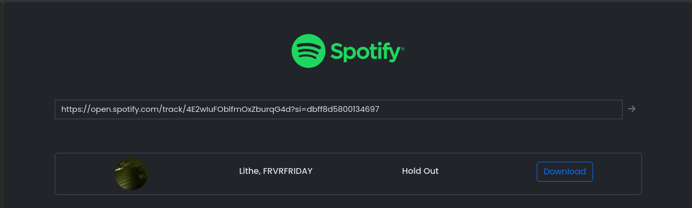

<p align="center"><a href="https://laravel.com" target="_blank"></a>


</p>


<h4 align="center">📱 Contact & 👨 Social</h4>
<p align="center">
<a href="mailto:anthonyobah37@gmail.com"></a>
<a href="https://github.com/obahchimaobi"></a>
<a href="https://linkedin.com/in/obahchimaobi"></a>
</p>

<h4 align="center">🚀 Skills</h4>
<p align="center">
<a href=""></a>
<a href=""></a>
<a href=""></a>
<a href=""></a>
<a href=""></a>
<a href=""></a>
<a href=""></a>
</p>

<h4 align="center">💻 OS</h4>
<p align="center">
<a href=""></a>
<a href=""></a>
</p>

---

# Spotify Music Downloader



## Overview

Spotify Music Downloader is a web application that allows users to download songs from Spotify by simply providing a Spotify track URL. This project is built using Laravel and integrates with the RapidAPI to fetch and download the desired tracks.

## Features

- Simple and user-friendly interface
- Fetches song details (artist, title, cover image) from Spotify
- Provides a download link for the specified track
- Built with Laravel framework

## Installation

1. **Clone the repository:**

   ```bash
   git clone https://github.com/yourusername/spotify-music-downloader.git
   cd spotify-music-downloader
   ```

2. **Install dependencies:**

   ```bash
   composer install
   npm install
   npm run dev
   ```

3. **Set up your environment variables:**

   Copy the `.env.example` file to `.env` and update the following variables:

   ```env
   RAPIDAPI_KEY=your_rapidapi_key
   ```

4. **Generate application key:**

   ```bash
   php artisan key:generate
   ```

5. **Run migrations:**

   ```bash
   php artisan migrate
   ```

6. **Serve the application:**

   ```bash
   php artisan serve
   ```

## Usage

1. Open the application in your web browser:

   ```
   http://localhost:8000
   ```

2. Enter the Spotify track URL in the input field and click the download button.

3. The application will fetch the song details and provide a download link.

## Screenshots


## API Integration

This project uses the RapidAPI to fetch song details and download links. Make sure to sign up on [RapidAPI](https://rapidapi.com/) and obtain an API key to use the service.

## Code Structure

- **Routes:** Defined in `routes/web.php`
- **Controllers:** Logic for handling requests is in `app/Http/Controllers`
- **Views:** Blade templates are in `resources/views`

## Contributing

Contributions are welcome! Please fork the repository and submit a pull request for any improvements or bug fixes.

## License

This project is licensed under the MIT License. See the [LICENSE](LICENSE) file for details.

---